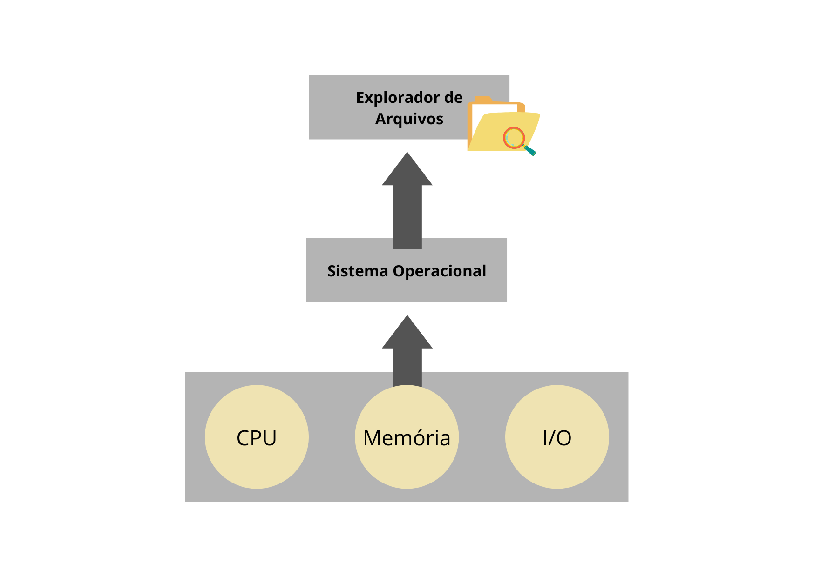

# bootcamp-linux-do-zero
Entendendo o que é Linux e suas funcionalidades

## O que é um Sistema Operacional?

O sistema operacional é um software, ou um conjunto de softwares, que tem a função de administrar ou genrenciar os recursos de um sistema. 

Esses recursos são: componentes de hardware, sistemas de arquivos, programas de terceiros, etc. 

_A principal função do sistema operacional é estabelecer uma interface entre o hardware e o usuário._

**O que é o Kernel ou núcleo do sistema operacional?**

Resumidamente, o Kernel é a ponte entre o usuário e o hardware. O kernel compõe a parte central do SO e responde por tarefas cruciais, como:

1. Estabelecer a camada de abstração de baixo nível (linguagem de máquina) com o hardware;
2. Gerenciar recursos como processador, memória RAM, sistemas de arquivos e dispositivos de entrada e saída;
3. Gerenciais processos (execução) de programas;
4. Gerenciar o uso de dispositivos, memória do sistema e chamadas dos programas, definindo quais têm prioridade.

_Sistemas operacionais domésticos mais utilizados:_
* Microsoft Windows
* Mac OS
* Linux

_Vídeo:_ [Most Popular Operating Systems [Desktops & Laptops] 2003-2019](https://youtu.be/eJuvKn5j_kE)

